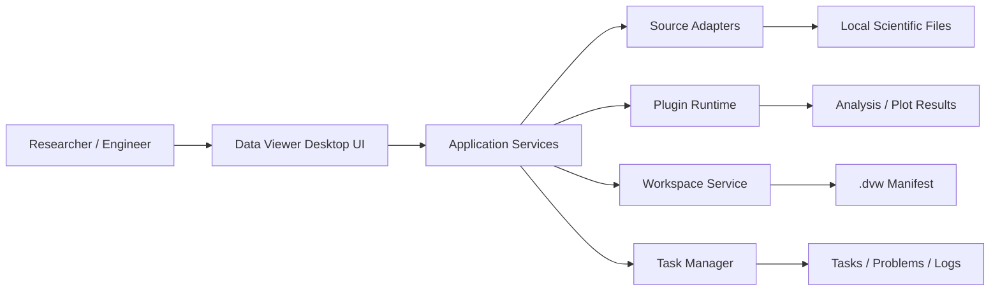
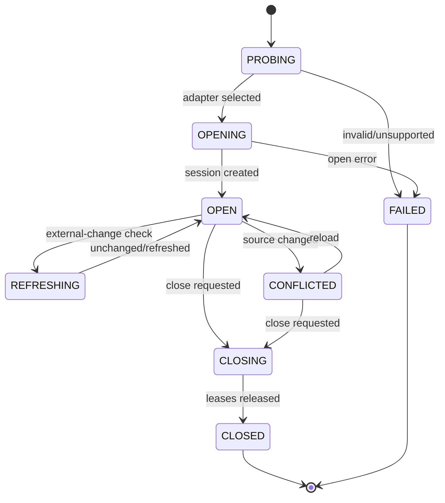

# Data Viewer Target Architecture

## 1. Purpose

This document defines the target architecture for Data Viewer v1. It is normative for module boundaries, ownership, threading, data identity, and runtime flow.

The current `core/`, `gui/`, and `plugins/` packages are legacy migration inputs. The former legacy `services/` package and empty `utils/` compatibility package were removed in DV-1008 and are preserved only in history. New architecture belongs under `data_viewer/` unless a task explicitly creates a compatibility bridge.

## 2. Architectural goals

- support multiple data domains without pretending every format is HDF5;
- keep raw source semantics separate from UI presentation;
- make expensive work bounded, asynchronous, cancellable, and observable;
- make edits reviewable and safe;
- provide stable DataSource, Plugin, and Workspace contracts;
- keep plugins independent from GUI internals;
- provide deterministic Windows and Linux behavior;
- allow vertical, incremental migration from the legacy application.

## 3. Context



Data Viewer v1 is local-first and offline. There is no server, account, telemetry, or remote plugin marketplace.

## 4. Layer model

```text
┌───────────────────────────────────────────────────────────────┐
│ ui                                                            │
│ Qt widgets, models, actions, focus, semantic theme tokens      │
├───────────────────────────────────────────────────────────────┤
│ app                                                           │
│ commands, active context, use cases, view-state orchestration  │
├───────────────────────┬───────────────────────────────────────┤
│ services              │ plugins                               │
│ search/export/compare │ API, runner, manifests, built-ins     │
├───────────────────────┼───────────────────────────────────────┤
│ sources               │ workspace                             │
│ adapters and sessions │ schema, persistence, relocation       │
├───────────────────────┴───────────────────────────────────────┤
│ tasks                                                         │
│ cancellation, progress, leases, budgets, result generations   │
├───────────────────────────────────────────────────────────────┤
│ domain                                                        │
│ identifiers, metadata, selections, patches, errors, results   │
└───────────────────────────────────────────────────────────────┘
```

Dependency rules:

```text
ui -> app -> domain
app -> services/sources/plugins/workspace/tasks
services/sources/plugins/workspace/tasks -> domain
domain -> standard library + NumPy type definitions only
```

Forbidden dependencies:

- domain importing PyQt widgets or format libraries;
- source adapters importing GUI modules;
- plugins importing MainWindow or concrete workspace widgets;
- widgets accessing adapter internals or another widget's private state;
- format-specific conditions in generic views.

## 5. Target package tree

```text
data_viewer/
├── __init__.py
├── __main__.py
├── app/
│   ├── bootstrap.py
│   ├── commands.py
│   ├── active_context.py
│   ├── document_controller.py
│   └── result_router.py
├── domain/
│   ├── identifiers.py
│   ├── data.py
│   ├── selections.py
│   ├── capabilities.py
│   ├── edits.py
│   ├── results.py
│   └── errors.py
├── sources/
│   ├── api.py
│   ├── registry.py
│   ├── sniffing.py
│   ├── gzip_wrapper.py
│   ├── hdf5.py
│   ├── numpy_source.py
│   ├── delimited.py
│   ├── text_source.py
│   ├── mat_source.py
│   ├── nifti_source.py
│   ├── xlsx_source.py
│   └── structured_source.py
├── tasks/
│   ├── cancellation.py
│   ├── progress.py
│   ├── budgets.py
│   ├── leases.py
│   └── manager.py
├── plugins/
│   ├── api.py
│   ├── manifests.py
│   ├── parameters.py
│   ├── registry.py
│   ├── runner.py
│   └── builtin/
├── workspace/
│   ├── schema.py
│   ├── persistence.py
│   ├── relocation.py
│   └── session_restore.py
├── services/
│   ├── search.py
│   ├── export.py
│   ├── compare.py
│   ├── edit_service.py
│   └── diagnostics.py
└── ui/
    ├── shell/
    ├── navigation/
    ├── workspace/
    ├── inspector/
    ├── tasks_panel/
    ├── views/
    ├── dialogs/
    └── theme/
```

Test packages mirror these boundaries under `tests/unit`, `tests/contract`, `tests/integration`, `tests/gui`, and `tests/performance`.

## 6. Core domain model

### 6.1 Data identity

`ResourceId` is the only canonical resource identifier:

```text
ResourceId = canonical source URI + adapter-stable node path
```

Examples:

- `file:///D:/data/run.h5` + `/results/fitness`;
- `file:///home/user/table.csv` + `/table`;
- `file:///data/book.xlsx` + `/sheets/Sheet1`;
- `file:///data/image.nii.gz` + `/volume`.

Display names, tab titles, and tree labels are never identifiers.

### 6.2 Data domains

- `HIERARCHICAL_ARRAY`
- `ARRAY`
- `TABLE`
- `TEXT`
- `STRUCTURED`
- `WORKBOOK`
- `VOLUME`
- `METADATA`

Adapters describe capabilities separately from domain. Two resources in the same domain may have different edit, slicing, streaming, or spatial capabilities.

### 6.3 DatasetViewState

Each open data view owns immutable identity plus replaceable state:

```text
DatasetViewState
├── resource_id
├── metadata_snapshot
├── normalized_selection
├── request_generation
├── operation_scope: full | slice | page | sample
├── source_payload_reference
├── presentation_projection
├── edit_patch_set
├── dirty_state
├── loading_state
├── error_state
└── view_configuration
```

The presentation projection may add row headers, formatted strings, axis order, color mapping, or downsampling. It can never replace the source payload for editing or semantic export.

## 7. Source architecture

### 7.1 Registry

The registry contains adapter descriptors, not open source instances. Adapter selection:

1. unwrap outer gzip metadata;
2. calculate candidate adapters from compound extension;
3. run bounded, side-effect-free probes;
4. reject ambiguous or malformed input with structured diagnostics;
5. open one source session through the selected adapter.

### 7.2 Source session ownership

- `DocumentController` owns source sessions.
- Views hold resource IDs, not file handles.
- Background tasks obtain bounded I/O leases.
- Closing a document transitions to `CLOSING`, cancels tasks, waits for leases, then closes the session.
- A failed open is never cached as an active session.

### 7.3 Source state machine



## 8. Task and threading architecture

### 8.1 Task contract

Every background task has:

- stable task ID;
- operation kind;
- owner document/workspace ID;
- cancellation token;
- progress reporter;
- memory/disk budget;
- request generation;
- structured result or structured error;
- timestamps and diagnostics context.

### 8.2 Rules

- Tasks never mutate widgets directly.
- Results return to the GUI thread through typed Qt signals or an application dispatcher.
- A result applies only when owner and generation still match.
- Cancellation stops scheduling new chunks; native calls finish the current bounded chunk.
- `QThread.terminate()` is forbidden.
- I/O leases prevent source close while a task uses it.

### 8.3 Task state machine

```text
QUEUED -> RUNNING -> SUCCEEDED
                 -> FAILED
                 -> CANCELLING -> CANCELLED
QUEUED -> CANCELLED
```

Terminal states are immutable.

### 8.4 Background export queue and diagnostics

Reviewed export plans enter an application export queue before bytes are written. Each queued export owns a `TaskRecord`, reports progress through the task state machine, and stores terminal `ExportReceipt` values in history. Cancellation is cooperative through the task cancellation token. Failed exports create Problems entries that link back to the export task, target path, source URI, and resource path; retry creates a new queued attempt instead of mutating the failed task.

Diagnostics bundles are built from safe app-layer values only: application/runtime/platform versions, plugin inventory, recent diagnostic events, and task records. The bundle service applies configured redaction before preview/export. Data Viewer never uploads diagnostics automatically.

## 9. Safe editing architecture

Editing uses a patch set, not a mutable presentation array.

```text
Read snapshot
  -> enter edit mode
  -> add typed patches
  -> validate values and coordinates
  -> review save summary
  -> compare source fingerprint
  -> write staging file or bounded native patch plan
  -> fsync/close
  -> atomic replace or explicit Save As
  -> refresh metadata and clear patches
```

HDF5 patch writes may target native hyperslabs after conflict validation. File-rewrite formats always write a sibling temporary file before replacement. Detailed behavior is normative in `docs/SAFE_EDITING.md`.

## 10. Plugin architecture

Plugins are pure domain/application extensions:

```text
PluginManifest + Plugin implementation
                  ↓
Capability matcher
                  ↓
Validated parameters
                  ↓
PluginContext + bounded data accessor
                  ↓
Background runner
                  ↓
Discriminated result
                  ↓
Result router -> workspace view / artifact / report
```

Plugins cannot choose arbitrary files, use widgets, or own source sessions. Built-in plugin discovery is an explicit packaged registry in v1.

## 11. Workspace architecture

The `.dvw` workspace is a versioned JSON manifest. It stores references and reproducible context, not source payloads.

Workspace loading occurs in two passes:

1. validate schema and migrate supported older schema versions;
2. resolve references and restore available UI/application state.

Missing references create degraded entries. They do not abort the workspace.

## 12. UI architecture

```text
Application Shell
├── Command Bar
├── Left Navigation
├── Workspace
│   └── active split tree -> tab groups -> views/results
├── Inspector
├── Bottom Panel: Tasks / Problems / Output
└── Status Bar
```

`ActiveContext` is the single source of truth for active split, tab, resource, selection, and view. Commands query ActiveContext; they do not scan tab widgets.

UI view models translate domain state to Qt models. Domain and adapters never emit user-facing message strings as control flow.

## 13. Cache and budget architecture

### Memory cache

Cache key includes:

- canonical source URI;
- source fingerprint;
- node path;
- normalized selection;
- requested dtype/projection;
- sampling parameters.

Writes, reloads, and fingerprint changes invalidate matching entries.

### Temporary extraction

Binary gzip wrappers use a managed cache directory with:

- per-task and total disk budgets;
- source fingerprint in cache identity;
- restricted permissions where supported;
- cancellation cleanup;
- startup cleanup for abandoned entries;
- no reuse after source fingerprint mismatch.

## 14. Error model

Errors are structured and preserve causal context:

```text
DataViewerError
├── code
├── message
├── operation
├── resource_id (optional)
├── retryable
├── details (redacted structured data)
└── cause (for logs, not raw UI rendering)
```

Adapters, task manager, plugin runner, workspace loader, and edit service use their defined error-code namespaces. UI maps codes to localized messages and recommended actions.

## 15. Configuration

- Defaults ship as packaged read-only resources.
- User config lives under `QStandardPaths.AppConfigLocation`.
- Workspace state is separate from preferences.
- Config includes schema version and is validated before use.
- Invalid config is backed up, reset to defaults, and reported in Problems.
- Tests redirect config/temp/cache roots to temporary directories.

## 16. Platform architecture

Windows and Linux are equal targets. Platform abstraction is required for:

- canonical paths and case sensitivity;
- atomic replace semantics;
- file-in-use behavior;
- temporary/cache locations;
- default fonts and shortcuts;
- packaging and resource paths;
- process launch and diagnostics.

No platform branch is allowed inside domain logic.

## 17. Migration strategy

1. Establish reproducible tests and target package skeleton.
2. Introduce domain contracts and adapter contract tests.
3. Migrate one vertical read-only HDF5 flow into `data_viewer/`.
4. Add task manager and active context.
5. Migrate UI shell and view state.
6. Add safe editing and export.
7. Implement remaining adapters one at a time through shared contract tests.
8. Stabilize Plugin API and add built-ins.
9. Add workspace persistence and productivity features.
10. remove legacy packages only after no target entrypoint imports them.

At every step, `python -m data_viewer` must start and completed target flows must remain green.

## 18. Architecture invariants

- one active-context owner;
- one source-session owner per open document;
- no widget owns a data handle;
- no force-killed I/O threads;
- no presentation array used as source truth;
- no implicit resampling or flattening;
- no unbounded read without an approved budget;
- no public interface change without contract tests and ADR review;
- no release without Windows and Linux packaged smoke tests.
