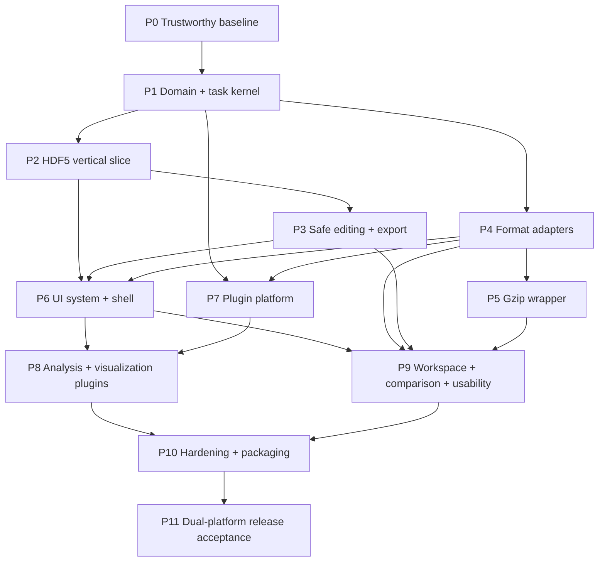

# Data Viewer v1 Implementation Plan

## 1. Outcome

Deliver a Windows/Linux desktop scientific data workbench named Data Viewer that opens every v1 format and gzip form, browses bounded data, analyzes/visualizes through Plugin API v1, compares resources, safely edits the approved formats, and restores versioned workspaces.

This is an implementation plan, not a statement of current behavior. `tasks/todo.md` is the checkable ledger.

## 2. Governing documents

Read in this order before implementation:

1. `AGENTS.md`
2. `docs/PRODUCT_SPEC.md`
3. `ARCHITECTURE.md`
4. relevant accepted ADRs in `docs/decisions/`
5. relevant contract in `docs/`
6. this plan and the selected task in `tasks/todo.md`

If documents conflict, stop and resolve the higher-priority source through an ADR/spec change. Do not silently choose.

## 3. Delivery method

- Work in dependency order and finish one task at a time.
- Prefer vertical slices that remain runnable.
- A task normally changes no more than 3–5 product files plus tests/docs.
- Write or update tests before behavior changes where feasible.
- Preserve unrelated user changes and legacy behavior until replacement passes removal criteria.
- Mark a checkbox only after its acceptance and verification pass for the current revision.
- Record checkpoint/release commands and results in `TEST_REPORT.md`.

## 4. Dependency graph

P3 and P4 may progress in parallel only when their shared domain/API types are stable and agents do not edit the same files. The repository rule still requires independent task completion and integration verification.

## 5. Phase plan

### P0 — Trustworthy baseline and project skeleton

Goal: make every later result reproducible.

Deliver:

- canonical `pyproject.toml`, dependency groups, lock/constraints, and target package skeleton;
- isolated configuration/test directories and complete pytest collection;
- lint/type/test/compile commands and CI test matrix before release jobs;
- fixture factories and evidence ledger;
- resolved PyQt6 distribution licensing decision before public packaging.

Exit checkpoint:

- clean Windows and Linux environments install from locks;
- full test collection succeeds with no import errors;
- legacy passing subset remains passing or deliberate changes are documented;
- CI runs tests, not only builds;
- no test writes repository/user configuration.

### P1 — Domain, DataSource API, tasks, errors, and ownership

Goal: create the stable kernel on which formats/UI/plugins depend.

Deliver:

- immutable ResourceId, domains, capabilities, metadata, selections, payload/result values;
- SourceAdapter/SourceSession and adapter registry;
- structured application/source/plugin errors;
- task states, cooperative cancellation, progress, request versioning;
- DocumentController source-session ownership and close protocol;
- bounded cache/config/log locations.

Exit checkpoint:

- shared fake adapter proves metadata/payload separation, pagination, selection normalization, cancellation, stale-result discard, and close ownership;
- no target GUI/plugin code imports raw format libraries except designated adapters/renderers;
- no forced thread termination.

### P2 — HDF5 target vertical slice

Goal: prove the architecture end to end before multiplying adapters.

Deliver:

- content probe, session lifecycle, direct-child listing, metadata, direct bounded selections;
- scalar/empty/1D/2D/high-dimensional/compound/string data behavior;
- target structure tree, active view, array/table view, inspector metadata;
- progress/cancel/error and repeated open/close behavior;
- compatibility bridge only where necessary and with removal ID.

Exit checkpoint:

- representative HDF5 files open and navigate without recursive full-tree/payload loading;
- rapid selection and close-during-read stress tests pass;
- legacy/target intentional differences are documented.

### P3 — Safe editing, Save As, and export

Goal: prove data integrity before broad UI or format claims.

Deliver:

- immutable patches, change set, dtype-aware validation, undo/redo/discard;
- dirty/conflict/save state machine and review summary;
- verified transaction/recovery service;
- HDF5 direct/replacement strategies;
- NPY, NPZ, CSV, TSV, TXT complete-file writers;
- explicit export scope/conversion plan/receipt.

Exit checkpoint:

- fault injection at every transaction step preserves a valid original or verified replacement;
- external modification never overwrites silently;
- property tests prove unchanged coordinates remain unchanged;
- read-only sources cannot reach overwrite code paths.

### P4 — Remaining format adapters

Goal: implement each format independently against common contracts.

Order:

1. NPY and NPZ;
2. CSV/TSV and TXT import-preview modes;
3. JSON and YAML;
4. MAT legacy and v7.3;
5. XLSX;
6. NIfTI.

Each adapter ships only after shared conformance, malformed/security, path, scale, and representative semantic fixtures pass. Remove NetCDF/Zarr product registration and dependencies during this phase.

Exit checkpoint:

- every uncompressed format opens its required matrix;
- all capabilities/edit modes are truthful;
- NIfTI affine/orientation/raw-vs-scaled, MAT variable representations, XLSX formula/external link safety, YAML safe loading, and NumPy no-pickle rules are proven.

### P5 — Generic gzip composition

Goal: satisfy gzip support without duplicating inner adapters.

Deliver:

- longest-first compound suffix/content detection;
- streaming wrapper for text-like sources;
- budgeted managed extraction for random-access formats;
- native `.nii.gz` routing;
- cache identity, free-disk checks, compression-ratio limits, progress/cancel, janitor;
- read-only/Save As messaging.

Exit checkpoint:

- every v1 format's gzip fixture opens;
- corrupt/truncated/bomb-like inputs fail safely;
- cancelled/startup-recovered tasks leave no incomplete files;
- `.npz.gz`/`.xlsx.gz` are labeled inefficient and never proposed as outputs.

### P6 — Design system and production shell

Goal: build a usable high-density workbench around correct data flows.

Deliver:

- light/dark semantic tokens, typography/spacing/icon system, standard components;
- command registry and explicit active context;
- authoritative navigation, tabs/splits, inspector, bottom Tasks/Output/Problems, status bar;
- virtualized tables, text, array/image/volume surfaces;
- complete state components and safe dialogs;
- keyboard, accessibility, high-DPI, English/Chinese resources.

Exit checkpoint:

- automated behavior and screenshot matrix passes at defined platform/size/theme/DPI states;
- no emoji/pseudo-icons or scattered palette values;
- long work never freezes the GUI and always exposes target/scope/cancel/error;
- minimum 1024×768 remains usable.

### P7 — Plugin platform

Goal: make analyses independently addable without GUI/source coupling.

Deliver:

- manifest JSON Schema, packaged built-in registry, duplicate/API diagnostics;
- compatibility evaluator with visible disabled reasons;
- standard parameter form renderer;
- task-based runner with budgets/cancellation/errors;
- typed results, declarative PlotSpec, provenance, workspace tabs, export;
- reusable plugin conformance suite and SDK example.

Exit checkpoint:

- a minimal reference plugin runs on chunks, cancels, errors safely, and publishes a provenance-complete result;
- forbidden imports are checked;
- unavailable plugin never crashes startup;
- API version compatibility tests pass.

### P8 — Statistics and visualization plugins

Goal: provide useful, numerically trustworthy analysis/visualization.

Deliver in small independent plugins:

- Dataset Profile, Descriptive Statistics, Distribution Summary, Correlation/Covariance, Dataset Compare;
- line, scatter, histogram, box, image, slice navigator, correlation heatmap, missing-data map;
- NIfTI orthogonal viewer and coordinate/header inspector;
- copy/export/theme/accessibility and explicit full/slice/selection/sample labeling.

Exit checkpoint:

- known-input numerical goldens and dtype/missing/nonfinite edge cases pass;
- sampling records method/seed/size and is never silent;
- plots are application-rendered and provenance complete;
- large inputs use chunks/budgets rather than implicit full materialization.

### P9 — Workspace, comparison, and usability

Goal: turn views into a durable daily workbench.

Deliver:

- JSON Schema-backed `.dvw` load/save/migration;
- partial/degraded restore, explicit relocation, stale result handling;
- comparison alignment/difference/link navigation;
- recent/pinned files, favorites, search/filter/regex, navigation history;
- session restore, external-change detection, diagnostics, background export;
- deterministic semantic layout persistence.

Exit checkpoint:

- workspace round trips deterministically and newer versions are protected;
- missing/moved/changed sources restore without silent identity mistakes;
- compare refuses ambiguous alignment;
- active context drives split/search/export/plugin actions correctly.

### P10 — Hardening, observability, naming, packaging

Goal: remove migration debt and produce diagnosable artifacts.

Deliver:

- structured logging, Problems/Diagnostics bundle with redaction;
- memory/cache/performance benchmarks and leak/stress fixes;
- canonical version and complete Data Viewer name migration;
- platform configuration migration;
- PyInstaller specs/builds, SBOM/licenses/checksums;
- CI package smoke and release dependency chain;
- removal of obsolete legacy modules after parity/reference tests.

Exit checkpoint:

- one version/name appears everywhere except explicit history;
- repeated open/close and stress stay within measured budgets;
- clean artifacts launch and open representative HDF5/CSV/NIfTI/workspace fixtures;
- no legacy import is used at runtime.

### P11 — Windows/Linux release acceptance

Goal: produce auditable v1 evidence, not merely binaries.

Run the full `docs/TESTING.md` matrix on both supported platforms, complete manual visual/accessibility/localization checks, resolve every release blocker in `RELEASE.md`, update README/CHANGELOG/TEST_REPORT from current behavior, then tag and publish artifacts/checksums/SBOM/licenses.

Exit checkpoint: every v1 requirement is traced to a passing automated/manual check on Windows and Linux; known limitations contain no undisclosed data-integrity or security issue.

## 6. Cross-cutting rules

### Data scale

- Metadata-first, lazy hierarchy, paginated table/tree, direct selections, bounded cache.
- Never call whole-resource materialization on ordinary navigation.
- Estimated bytes, configured budgets, and sampling/full scope are visible.

### Security

- Treat all files/workspaces/manifests as untrusted.
- `allow_pickle=False`, YAML restricted loading, no macro/formula/external-link execution, no HDF5 external-link following, archive/decompression budgets.
- No runtime network or arbitrary plugin installation in v1.

### Reliability

- Source session ownership is explicit.
- Cancellation is cooperative and tasks publish no stale result.
- Disk mutation follows `docs/SAFE_EDITING.md` and is fault tested.

### UI quality

- Target/scope/provenance always visible.
- Every async surface has all standard states.
- Keyboard/accessibility/localization are part of each component, not a final patch.

## 7. Risk register

| Risk | Early control | Release evidence |
|---|---|---|
| silent data corruption | P3 patches/transactions before broad editing | fault matrix + reopen/property tests |
| GUI freeze/memory blowup | P1 tasks/budgets, P2 vertical slice | platform performance/stress reports |
| format semantic loss | one adapter/conformance gate at a time | format fixture matrix |
| NIfTI orientation error | preserve source affine and coordinate mapping | known affine/orientation goldens |
| unsafe deserialization | fixed security rules and adversarial fixtures | security test suite |
| plugin architecture erosion | public API/forbidden import tests | conformance suite |
| workspace path mistakes | explicit fingerprint/relocation/degraded mode | moved/ambiguous tests |
| cross-platform package failure | CI test before build; installed smoke | Windows/Linux artifact logs |
| documentation drift | README current-vs-target labels and release review | link/conflict scan + release audit |
| licensing incompatibility | Phase 0 owner decision | recorded license/SBOM approval |

## 8. Traceability

Every functional requirement `FR-001` through `FR-010` and nonfunctional requirement in `docs/PRODUCT_SPEC.md` must be referenced by at least one task and test. The release manager generates a traceability table with requirement, implementation task/PR, test ID, platform result, and evidence artifact. Untraced requirements block release.

## 9. Change control

- Scope/format/edit/platform changes update Product Spec and a new/superseding ADR before task changes.
- Public API/on-disk changes update the contract and compatibility tests before implementation.
- Phase ordering may change only with documented dependency and risk reasoning.
- Defer new formats/features to a post-v1 roadmap; do not hide scope growth inside an adapter/plugin task.
